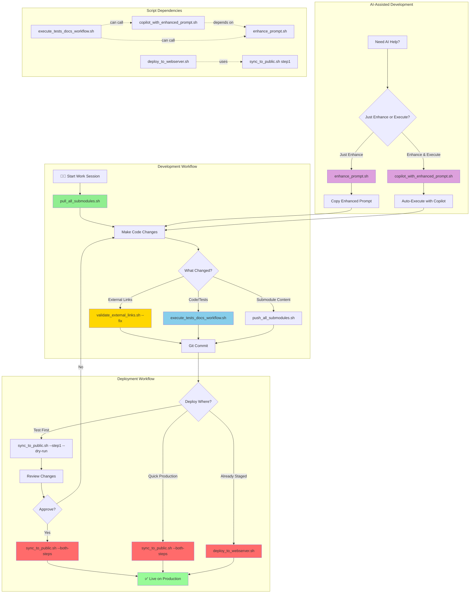

# Shell Scripts Directory

This directory contains shell automation scripts for managing the MP Barbosa personal website project and its git submodules.

## 🗺️ Quick Script Selection Guide

**Use this decision tree to quickly find the right script for your task:**

```
What do you need to do?
│
├─ 📥 UPDATE CODE FROM REMOTE?
│  └─ Run: ./shell_scripts/pull_all_submodules.sh
│     Purpose: Pull main repo + all submodules
│     When: After other developers push changes, starting work session
│
├─ 📤 DEPLOY CODE CHANGES?
│  ├─ To staging (public directory)?
│  │  └─ Run: ./shell_scripts/sync_to_public.sh --step1
│  │     Purpose: Sync src/ to public/ for testing
│  │     When: Testing deployment before production
│  │
│  ├─ To production (nginx server)?
│  │  ├─ Full two-step deployment?
│  │  │  └─ Run: ./shell_scripts/sync_to_public.sh --both-steps
│  │  │     Purpose: Complete staging + production deployment
│  │  │     When: Ready to go live with changes
│  │  │
│  │  └─ Production only (after step1)?
│  │     └─ Run: sudo ./shell_scripts/deploy_to_webserver.sh
│  │        Purpose: Deploy public/ to /var/www/html
│  │        When: Public directory already prepared
│  │
│  └─ Push submodule changes to remote?
│     └─ Run: ./shell_scripts/push_all_submodules.sh --handle-stash
│        Purpose: Push all submodules hierarchically
│        When: Changes made to submodule content
│
├─ 🧪 RUN TESTS & UPDATE DOCS?
│  └─ Run: ./shell_scripts/execute_tests_docs_workflow.sh
│     Purpose: 13-step AI-powered test & documentation workflow
│     When: After significant changes, before commits
│     Modes: --interactive (default), --auto (CI/CD), --dry-run (preview)
│
├─ 🔗 VALIDATE SECURITY?
│  └─ Run: ./shell_scripts/validate_external_links.sh
│     Purpose: Check external links for security attributes
│     When: After adding/modifying external links
│     Fix: Auto-fix with --fix flag
│
└─ 🤖 IMPROVE AI PROMPTS?
   ├─ Just enhance prompt?
   │  └─ Run: ./shell_scripts/enhance_prompt.sh "your prompt"
   │     Purpose: Get enhanced version of prompt
   │     When: Want better AI responses, learning prompt engineering
   │
   └─ Enhance and execute with Copilot?
      └─ Run: ./shell_scripts/copilot_with_enhanced_prompt.sh "your prompt"
         Purpose: Auto-enhance and run with GitHub Copilot
         When: Want better Copilot results automatically
```

**Quick Command Reference**:
| Task | Command | Frequency |
|------|---------|-----------|
| Start work session | `./shell_scripts/pull_all_submodules.sh` | Daily |
| Test deployment | `./shell_scripts/sync_to_public.sh --step1 --dry-run` | Before production |
| Deploy to production | `./shell_scripts/sync_to_public.sh --both-steps` | Weekly/as needed |
| Run tests & docs | `./shell_scripts/execute_tests_docs_workflow.sh` | Before major commits |
| Validate links | `./shell_scripts/validate_external_links.sh --fix` | After link changes |
| Better AI prompts | `./shell_scripts/copilot_with_enhanced_prompt.sh "task"` | As needed |

---

## 📊 Workflow Diagram

**Visual overview of script relationships, dependencies, and typical workflows:**



**Workflow Categories**:

1. **🔄 Development Workflow** (Green): Daily development cycle
   - Pull updates → Make changes → Validate → Test → Commit

2. **🚀 Deployment Workflow** (Red/Pink): Production deployment paths
   - Test deployment → Review → Full deployment → Live
   - Or: Quick production (trusted changes)
   - Or: Legacy deployment (pre-staged files)

3. **🤖 AI-Assisted Development** (Purple): AI tooling integration
   - Prompt enhancement for better AI responses
   - Direct Copilot execution with auto-enhancement

4. **🔗 Script Dependencies** (Dotted lines): Inter-script relationships
   - `copilot_with_enhanced_prompt.sh` depends on `enhance_prompt.sh`
   - `deploy_to_webserver.sh` uses output from `sync_to_public.sh --step1`
   - `execute_tests_docs_workflow.sh` can invoke AI prompt scripts

**Key Decision Points**:
- 🔶 **What Changed?** → Determines which validation/testing to run
- 🔶 **Deploy Where?** → Chooses deployment path (test/production/legacy)
- 🔶 **Approve?** → Manual review gate before production
- 🔶 **Just Enhance or Execute?** → AI workflow selection

**ASCII Art Version** (for terminals without Mermaid support):

```
┌─────────────────────────────────────────────────────────────────────┐
│                     DEVELOPMENT WORKFLOW                            │
└─────────────────────────────────────────────────────────────────────┘

    START SESSION
         │
         ▼
    pull_all_submodules.sh ──────► Update main repo + submodules
         │
         ▼
    Make Changes
         │
         ▼
    ┌────────────────┐
    │  What Changed? │
    └────────┬───────┘
         ┌───┴───┬──────────┬──────────┐
         ▼       ▼          ▼          ▼
    External  Code/   Submodule   Nothing
     Links   Tests    Content
         │       │          │
         ▼       ▼          ▼
validate_  execute_  push_all_
external_  tests_    submodules.sh
links.sh   docs_
           workflow.sh
         │       │          │
         └───┬───┴──────────┘
             ▼
        Git Commit
             │
             ▼

┌─────────────────────────────────────────────────────────────────────┐
│                     DEPLOYMENT WORKFLOW                             │
└─────────────────────────────────────────────────────────────────────┘

    Git Commit
         │
         ▼
    ┌─────────────┐
    │Deploy Where?│
    └──────┬──────┘
         ┌─┴──────┬────────────┬──────────────┐
         ▼        ▼            ▼              ▼
    Test First  Quick    Already Staged   Skip Deploy
         │     Production      │
         ▼        │            ▼
    sync_to_     │     deploy_to_webserver.sh
    public.sh    │            │
    --step1      │            │
    --dry-run    │            │
         │       │            │
         ▼       │            │
    Review       │            │
    Changes      │            │
         │       │            │
         ▼       ▼            ▼
    ┌─────────┐  │            │
    │Approve? │  │            │
    └────┬────┘  │            │
         │       │            │
    ┌────┴────┐  │            │
    ▼         ▼  ▼            ▼
   Yes       No  sync_to_     │
    │         │  public.sh    │
    │         │  --both-steps │
    │         │       │       │
    │         └───────┼───────┘
    │                 │
    ▼                 ▼
sync_to_         ┌────────────────┐
public.sh        │ ✅ PRODUCTION │
--both-steps     └────────────────┘
    │
    └─────────────┘

┌─────────────────────────────────────────────────────────────────────┐
│                  AI-ASSISTED DEVELOPMENT                            │
└─────────────────────────────────────────────────────────────────────┘

    Need AI Help?
         │
         ▼
    ┌──────────────────────────┐
    │Just Enhance or Execute?  │
    └────────┬─────────────────┘
         ┌───┴───┐
         ▼       ▼
    Just       Enhance
   Enhance   & Execute
         │       │
         ▼       ▼
  enhance_  copilot_with_
  prompt.sh enhanced_prompt.sh
         │       │
         ▼       ▼
    Copy     Auto-Execute
   Enhanced   with Copilot
    Prompt       │
         │       │
         └───┬───┘
             ▼
      Back to Changes

┌─────────────────────────────────────────────────────────────────────┐
│                   SCRIPT DEPENDENCIES                               │
└─────────────────────────────────────────────────────────────────────┘

copilot_with_enhanced_prompt.sh ───depends on──► enhance_prompt.sh
deploy_to_webserver.sh ─────────uses output──► sync_to_public.sh (step1)
execute_tests_docs_workflow.sh ──can invoke──► enhance_prompt.sh
                                ──can invoke──► copilot_with_enhanced_prompt.sh
```

---

## 🚀 First-Time Setup

**Important**: Before running any scripts, ensure they have executable permissions:

```bash
# Make all scripts executable (run once from project root)
chmod +x shell_scripts/*.sh

# Or make individual scripts executable
chmod +x shell_scripts/pull_all_submodules.sh
chmod +x shell_scripts/push_all_submodules.sh
chmod +x shell_scripts/sync_to_public.sh
chmod +x shell_scripts/deploy_to_webserver.sh
chmod +x shell_scripts/execute_tests_docs_workflow.sh
chmod +x shell_scripts/validate_external_links.sh
chmod +x shell_scripts/enhance_prompt.sh
chmod +x shell_scripts/copilot_with_enhanced_prompt.sh
```

**Verify permissions**:
```bash
# Check if scripts are executable (look for 'x' in permissions)
ls -l shell_scripts/*.sh
```

**Expected output**: `-rwxr-xr-x` (the 'x' indicates executable)

**Troubleshooting**:
- If you get `Permission denied` error, run the chmod commands above
- If scripts still don't run, check your shell with `echo $SHELL`
- Ensure you're running bash scripts with bash: `bash shell_scripts/script_name.sh`

**Current Script Status** (all scripts should be executable):

| Script | Purpose | Executable Required |
|--------|---------|---------------------|
| `pull_all_submodules.sh` | Pull main repo + submodules | ✅ Yes |
| `push_all_submodules.sh` | Push changes to submodules | ✅ Yes |
| `sync_to_public.sh` | Two-step deployment | ✅ Yes |
| `deploy_to_webserver.sh` | Legacy nginx deployment | ✅ Yes (requires sudo) |
| `execute_tests_docs_workflow.sh` | AI-powered test & docs | ✅ Yes |
| `validate_external_links.sh` | Link security validation | ✅ Yes |
| `enhance_prompt.sh` | AI prompt enhancement | ✅ Yes |
| `copilot_with_enhanced_prompt.sh` | Enhanced Copilot execution | ✅ Yes |

---

## Available Scripts

### 🔄 `pull_all_submodules.sh`
**Purpose**: Pulls the main repository and all submodules in proper hierarchical order

**Features**:
- ✅ Pulls main repository first
- ✅ Recursively fetches and updates all submodules  
- ✅ Handles nested submodules properly
- ✅ Safe stash management for local changes
- ✅ Comprehensive status verification
- ✅ Colored output for better visibility

**Usage**:
```bash
./shell_scripts/pull_all_submodules.sh           # Pull everything
./shell_scripts/pull_all_submodules.sh --help    # Show help
./shell_scripts/pull_all_submodules.sh --dry-run # Preview operations
```

**Order of Operations**:
1. Fetch and pull main repository
2. Fetch all submodules recursively
3. Update all submodules to latest remote versions
4. Verify individual submodule status
5. Initialize any missing submodules
6. Show final status summary

---

### 🚀 `push_all_submodules.sh`
**Purpose**: Pushes all modified files in proper hierarchical order (bottom-up approach)

**Features**:
- ✅ Bottom-up push strategy (deepest submodules first)
- ✅ Interactive commit message prompts
- ✅ Submodule reference updates in main repository
- ✅ Optional stash handling and commitment
- ✅ Comprehensive status verification
- ✅ Colored output for better visibility

**Usage**:
```bash
./shell_scripts/push_all_submodules.sh                  # Push all changes interactively
./shell_scripts/push_all_submodules.sh --handle-stash  # Include stashed modifications  
./shell_scripts/push_all_submodules.sh --dry-run       # Preview operations
./shell_scripts/push_all_submodules.sh --help          # Show help
```

**Push Order**:
1. Deepest nested submodules first
2. Direct submodules
3. Update main repository submodule references
4. Main repository last

---

### 📁 `sync_to_public.sh` (Two-Step Deployment Architecture v2.0.0)
**Purpose**: Two-step deployment process for MP Barbosa site with parametrized step control

**Recent Changes (v2.0.0)**:
- ✅ **Complete architectural transformation**: Single-step → Two-step deployment
- ✅ **Parametrized step control**: Execute step1, step2, or both independently
- ✅ **Production directory configuration**: `--production-dir` parameter support
- ✅ **Enhanced summary reporting**: Separate summaries for each deployment step
- ✅ **Comprehensive test coverage**: 849 lines of Jest tests (53 tests, 52/53 passing)
- ✅ **Improved help documentation**: Step-specific examples and options

**Features**:
- ✅ **Step 1**: Copy resources from /src to /public folder for staging
- ✅ **Step 2**: Copy resources from /public to production web server directory
- ✅ Parametrized execution (step1, step2, or both-steps)
- ✅ Production directory configuration support (default: `/var/www/html`)
- ✅ Comprehensive asset management (HTML, CSS, JS, images, webfonts)
- ✅ Music in Numbers submodule support with complete module architecture
- ✅ Enhanced backup system for both public and production deployments
- ✅ Comprehensive validation and reporting for each step
- ✅ Dry-run mode for safe operation preview

**Usage**:
```bash
# Step Options (at least one required)
./shell_scripts/sync_to_public.sh --step1                              # Copy source to public only
./shell_scripts/sync_to_public.sh --step2                              # Copy public to production only  
./shell_scripts/sync_to_public.sh --both-steps                         # Execute both steps
./shell_scripts/sync_to_public.sh --step1 --dry-run --verbose          # Preview step 1 with details
./shell_scripts/sync_to_public.sh --step2 --production-dir /var/www/mpbarbosa  # Custom production directory
./shell_scripts/sync_to_public.sh --both-steps --no-backup --verbose   # Both steps without backup
./shell_scripts/sync_to_public.sh --help                               # Show help
```

**Two-Step Process**:
**Step 1 (Source → Public)**:
1. Environment validation and backup creation
2. Main HTML files (index.html, robots.txt, humans.txt)
3. Asset directories (CSS, JS, SASS, webfonts, images)  
4. Music in Numbers submodule (3 HTML files, 15+ JS modules, 4 CSS files)
5. Comprehensive validation of all copied resources

**Step 2 (Public → Production)**:
1. Production environment validation and permission checks
2. Production backup creation with 7-day retention  
3. Efficient file synchronization using rsync/cp
4. Production deployment validation
5. Web server ready file structure (755/644 permissions)

**Production Directory Options**:
- Default: `/var/www/html`
- Custom: `--production-dir /path/to/webroot`
- Configurable for different deployment scenarios

**Key Architecture Benefits**:
- **Flexible Deployment**: Independent or combined step execution
- **Staging Environment**: Public folder acts as staging area for validation
- **Production Safety**: Separate production deployment with comprehensive validation
- **Parametrized Control**: Choose exactly which deployment steps to execute
- **Enhanced Backup**: Separate backup systems for public and production environments

---

### 🌐 `deploy_to_webserver.sh` (Legacy Deployment v2.0.0)
**Purpose**: Deploys the website to nginx web server directory for production hosting

**⚠️ Architecture Note**: This script now uses the `/public` directory as its source (prepared by `sync_to_public.sh`). For modern deployments, use the two-step `sync_to_public.sh` workflow instead.

**Recent Changes (v2.0.0)**:
- ✅ **Source changed**: Now deploys from `PROJECT_ROOT/public` instead of `PROJECT_ROOT`
- ✅ **Dependency requirement**: Requires `sync_to_public.sh --step1` to be run first
- ✅ **Git validation**: Checks project root for git repository (not source directory)
- ✅ **Path updates**: All validation paths updated for new public directory structure
- ✅ **Comprehensive test coverage**: 849 lines of Jest tests (53 tests, 52/53 passing)
- ✅ **Help documentation**: Updated workflow and requirement sections

**Features**:
- ✅ Deploys from pre-staged `/public` directory
- ✅ Automatic backup of existing production deployment
- ✅ Git submodule validation (checks project root)
- ✅ Web server permission setting (www-data)
- ✅ nginx configuration validation
- ✅ Comprehensive deployment validation
- ✅ Colored output for better visibility

**Usage**:
```bash
# First, prepare files in public directory
./shell_scripts/sync_to_public.sh --step1

# Then deploy to production (requires sudo)
sudo ./shell_scripts/deploy_to_webserver.sh             # Full deployment
./shell_scripts/deploy_to_webserver.sh --dry-run       # Preview deployment
./shell_scripts/deploy_to_webserver.sh --no-backup     # Deploy without backup
./shell_scripts/deploy_to_webserver.sh --help          # Show help
```

**Deployment Process**:
1. Validate environment and git submodules (checks `PROJECT_ROOT`, not source)
2. **Verify `/public` directory exists** (fails if missing - run `sync_to_public.sh --step1` first)
3. Create backup of existing deployment to `/var/www/backups/mpbarbosa.com`
4. Copy all files from `/public` to `/var/www/mpbarbosa.com` using rsync
5. Set proper web server permissions (www-data:www-data, 755/644)
6. Validate deployment structure (checks `index.html`, `assets/css/main.css`, `assets/js/main.js`)
7. Check nginx configuration

**Modern Alternative**: Use `sync_to_public.sh --both-steps` for the complete two-step deployment workflow with production directory configuration support.

---

### 📋 `execute_tests_docs_workflow.sh` (v2.0.0)
**Purpose**: AI-powered automation for complete tests and documentation update workflow

**Architecture Status**: 🎉 **Phase 3 Complete - Fully Modularized** (v2.0.0)
- ✅ **20 extracted modules**: 8 library modules + 12 step modules
- ✅ **4,313 lines modularized**: Professional separation of concerns
- ✅ **Single responsibility**: Each module focused on specific domain
- ✅ **Testable components**: 54 automated tests with 100% pass rate
- ✅ **Ready for Phase 4**: Main script integration pending

**Features**:
- ✅ **13-step comprehensive workflow** from analysis to git finalization
- ✅ **AI-powered analysis** using GitHub Copilot CLI with 11 specialized personas
- ✅ **Two-phase validation architecture**: Automated detection + AI-powered deep analysis
- ✅ **Conventional commit generation**: AI-assisted commit message creation with git context
- ✅ **Smart triggering modes**: Auto, Interactive, and Dry-run
- ✅ **Progress tracking**: Workflow state management with completion status
- ✅ **Comprehensive validation**: Documentation consistency, test coverage, dependencies
- ✅ **Temporary file cleanup**: Automatic cleanup with trap handlers
- ✅ **Colored output**: Professional progress indicators and status messages

**Usage**:
```bash
# Full automated workflow (interactive mode, default)
./shell_scripts/execute_tests_docs_workflow.sh

# Preview without executing
./shell_scripts/execute_tests_docs_workflow.sh --dry-run

# Automatic mode (CI/CD compatible, no prompts)
./shell_scripts/execute_tests_docs_workflow.sh --auto

# Combined for safe testing
./shell_scripts/execute_tests_docs_workflow.sh --dry-run --auto

# Show help and options
./shell_scripts/execute_tests_docs_workflow.sh --help
```

**Workflow Steps**:
1. **Step 0**: Pre-Analysis - Git status, commits, change scope definition
2. **Step 1**: Update Documentation - AI-powered documentation specialist analysis
3. **Step 2**: Check Consistency - AI-powered cross-reference and version validation
4. **Step 3**: Validate Script References - AI-powered DevOps documentation expert
5. **Step 4**: Validate Directory Structure - AI-powered software architect review
6. **Step 5**: Review Existing Tests - AI-powered QA engineer analysis
7. **Step 6**: Generate New Tests - AI-powered TDD expert test generation
8. **Step 7**: Execute Test Suite - AI-powered CI/CD specialist execution & analysis
9. **Step 8**: Validate Dependencies - AI-powered package management specialist
10. **Step 9**: Code Quality Validation - AI-powered software quality engineer
11. **Step 10**: Context Analysis - AI-powered technical project manager summary
12. **Step 11**: Git Finalization - AI-powered conventional commit message generation

**AI-Enhanced Features**:
- **11 Specialized AI Personas**: Each step uses domain-expert personas (Git Workflow Specialist, DevOps Engineer, QA Automation Engineer, etc.)
- **Modern Copilot CLI Integration**: Uses `copilot -p` for interactive persona-based analysis
- **Conventional Commits**: Step 11 generates professional commit messages following conventional commit standards
- **Graceful Fallbacks**: Works without Copilot CLI installed (automated validation continues)
- **Context-Rich Prompts**: AI receives comprehensive repository state, diff analysis, and categorized changes

**Best Practices Applied** (v2.0.0):
- ✓ Interactive `copilot -p` workflow with copy-paste for AI output
- ✓ Auto-mode skip for interactive AI features (CI/CD compatibility)
- ✓ Temporary file management with automatic cleanup
- ✓ Comprehensive git context analysis for commit messages
- ✓ Two-phase architecture: Automated + AI-powered validation
- ✓ **Modular architecture**: Professional separation of concerns
- ✓ **Reusable components**: Libraries shared across multiple scripts
- ✓ **Testable modules**: Comprehensive test coverage with Jest

**Modular Architecture** (v2.0.0 - Phase 3 Complete):
The workflow script has been fully modularized into professional components:

- **8 Library Modules** (1,035 lines total):
  - `lib/config.sh` - Configuration and constants (55 lines)
  - `lib/colors.sh` - ANSI color definitions (18 lines)
  - `lib/utils.sh` - Utility functions (194 lines)
  - `lib/git_cache.sh` - Git state caching (129 lines)
  - `lib/validation.sh` - Pre-flight checks (151 lines)
  - `lib/backlog.sh` - Issue tracking (89 lines)
  - `lib/summary.sh` - Summary generation (132 lines)
  - `lib/ai_helpers.sh` - AI integration (267 lines)

- **13 Step Modules** (4,611 lines total):
  - `steps/step_00_analyze.sh` - Pre-workflow change analysis (57 lines)
  - `steps/step_01_documentation.sh` - Documentation updates (326 lines)
  - `steps/step_02_consistency.sh` - Consistency analysis (329 lines)
  - `steps/step_03_script_refs.sh` - Script reference validation (353 lines)
  - `steps/step_04_directory.sh` - Directory structure validation (375 lines)
  - `steps/step_05_test_review.sh` - Test review (387 lines)
  - `steps/step_06_test_gen.sh` - Test generation (439 lines)
  - `steps/step_07_test_exec.sh` - Test execution (392 lines)
  - `steps/step_08_dependencies.sh` - Dependency validation (458 lines)
  - `steps/step_09_code_quality.sh` - Code quality validation (426 lines)
  - `steps/step_10_context.sh` - Context analysis (377 lines)
  - `steps/step_11_git.sh` - **AI-powered git finalization** (485 lines) ⭐

**Total Modularization**: 5,646 lines extracted from monolithic script (1,035 libs + 4,611 steps)

**Phase 3 Highlights**:
- ✅ All 13 step modules fully extracted
- ✅ Step 11 includes Git Workflow Specialist AI persona
- ✅ AI-powered conventional commit message generation
- ✅ Two-phase git finalization (automated analysis + AI enhancement)
- ✅ Professional separation of concerns achieved

**Related Documentation**:
- Module Documentation: `/shell_scripts/workflow/README.md`
- Development Plan: `/docs/TESTS_DOCS_WORKFLOW_AUTOMATION_PLAN.md`
- Phase 1 Completion: `/docs/WORKFLOW_MODULARIZATION_PHASE1_COMPLETION.md`
- Phase 2 Completion: `/docs/WORKFLOW_MODULARIZATION_PHASE2_COMPLETION.md`
- Phase 3 Completion: `/docs/WORKFLOW_MODULARIZATION_PHASE3_COMPLETION.md` ⭐
- Step 11 Enhancement: `/docs/STEP11_GIT_FINALIZATION_ENHANCEMENT.md`
- Workflow Specification: `/prompts/tests_documentation_update_enhanced.txt`

**Workflow Output Directories**:

The workflow automation script generates three types of outputs in dedicated directories:

#### 📊 `/logs/` - Raw Execution Logs (v1.5.0)
**Purpose**: Complete execution traces and AI session logs

**Contents**:
- `workflow_YYYYMMDD_HHMMSS/` - Individual workflow run logs
  - `step{N}_copilot_*.log` - GitHub Copilot CLI interaction logs for AI-enhanced steps
  - `workflow_execution.log` - Main script execution trace (optional)

**Use Cases**:
- Debugging workflow script behavior
- Auditing AI-powered analysis sessions
- Troubleshooting GitHub Copilot CLI integration
- Performance monitoring and optimization

**Retention**: 30 days (raw debugging data, high volume)

**Documentation**: `/logs/README.md`

#### 📋 `/backlog/` - Detailed Issue Reports (v1.3.0)
**Purpose**: Comprehensive technical findings and validation output

**Contents**:
- `workflow_YYYYMMDD_HHMMSS/` - Individual workflow run reports
  - `WORKFLOW_SUMMARY.md` - Overview of entire run
  - `step{N}_{description}.md` - Detailed findings with raw output per step

**Use Cases**:
- Detailed troubleshooting and debugging
- Finding specific file/line references for issues
- Understanding validation tool output
- Tracking issue resolution progress

**Retention**: 90 days (detailed history for recurring problems)

**Documentation**: `/backlog/README.md`

#### 📝 `/summaries/` - High-Level Conclusions (v1.4.0)
**Purpose**: Quick-reference status summaries for rapid review

**Contents**:
- `workflow_YYYYMMDD_HHMMSS/` - Individual workflow run summaries
  - `step{N}_{description}_summary.md` - Concise 2-3 sentence conclusions with status (✅/⚠️/❌)

**Use Cases**:
- Quick status checks for team updates
- Daily standup reports
- Code review preparation
- CI/CD pipeline status parsing

**Retention**: Indefinite (lightweight, high value for trend analysis)

**Documentation**: `/summaries/README.md`

#### Output Directory Comparison

| Directory | Version | Purpose | Audience | Length | Retention |
|-----------|---------|---------|----------|--------|-----------|
| **logs/** | v1.5.0 | Raw traces & AI sessions | Developers (debug) | Full logs | 30 days |
| **backlog/** | v1.3.0 | Detailed reports | Developers (fixing) | Full reports | 90 days |
| **summaries/** | v1.4.0 | Quick conclusions | Managers (overview) | 2-3 sentences | Indefinite |

#### Version Evolution Timeline

- **v1.2.0** (Nov 4, 2025): Initial AI-powered workflow automation
- **v1.3.0** (Nov 5, 2025): Added `/backlog/` for issue tracking
- **v1.4.0** (Nov 6, 2025): Added `/summaries/` for quick-reference conclusions
- **v1.5.0** (Nov 9, 2025): Added `/logs/` for execution traces + performance optimization

#### Quick Reference: Which Directory to Use?

**For Quick Status**: → `/summaries/` (2-3 sentence conclusions, ✅/⚠️/❌ status)  
**For Debugging**: → `/logs/` (raw execution traces, AI session logs)  
**For Fixing Issues**: → `/backlog/` (detailed findings, file references, raw tool output)  
**For Team Updates**: → `/summaries/` (lightweight, easy to share)  
**For Trend Analysis**: → `/summaries/` (kept indefinitely, compare across runs)

---

### ✅ `validate_external_links.sh`
**Purpose**: Validates that all external links follow the security policy of opening in new tabs with proper attributes

**Features**:
- ✅ Scans all HTML files across main site and submodules
- ✅ Identifies external links (http/https URLs in `<a>` tags)
- ✅ Validates `target="_blank"` attribute presence
- ✅ Validates `rel="noopener noreferrer"` security attributes
- ✅ Colored output showing compliant and non-compliant links
- ✅ Line-by-line reporting with exact file locations
- ✅ Comprehensive validation summary with issue count
- ✅ Exit code 0 for success, 1 for failures (CI/CD compatible)

**Usage**:
```bash
# Standard validation (from project root)
./shell_scripts/validate_external_links.sh

# Run from any directory
cd /path/to/mpbarbosa_site && ./shell_scripts/validate_external_links.sh

# Use in CI/CD pipeline
./shell_scripts/validate_external_links.sh || exit 1
```

**Validation Criteria**:
- ✅ All `<a>` tags with external URLs (http/https) must have `target="_blank"`
- ✅ All external links must include `rel="noopener noreferrer"` for security
- ✅ Excludes `<link>` tags (stylesheets/fonts don't need these attributes)
- ✅ Checks main site files and all submodule HTML files

**Files Scanned**:
```
src/index.html              # Main landing page
src/components/*.html       # Component files
src/pages/*.html           # Redirect pages
src/submodules/*/src/*.html # Submodule HTML files
```

**Output Format**:

**Example - All Compliant**:
```
=== External Links Policy Validation ===

Scanning HTML files...

Checking: src/index.html
  ✅ Line 127: Compliant
  ✅ Line 134: Compliant
  ✅ Line 141: Compliant

=== Validation Summary ===
✅ All external links are compliant!
```

**Example - Issues Found**:
```
=== External Links Policy Validation ===

Scanning HTML files...

Checking: src/pages/example.html
  ❌ Line 42: Missing target="_blank"
     <a href="https://example.com">Link</a>
  ❌ Line 55: Missing rel="noopener noreferrer"
     <a href="https://example.com" target="_blank">Link</a>
  ✅ Line 68: Compliant

=== Validation Summary ===
❌ Found 2 issue(s) that need fixing
Please review and apply the correct attributes:
  target="_blank" rel="noopener noreferrer"
```

**Security Benefits**:
- **`target="_blank"`**: Opens external links in new tabs, preventing navigation away from your site
- **`rel="noopener"`**: Prevents the new page from accessing `window.opener` (tabnapping attack prevention)
- **`rel="noreferrer"`**: Prevents sending the `Referer` header to external sites (privacy protection)

**Common Fixes**:

**Before** (Non-compliant):
```html
<a href="https://example.com">External Link</a>
<a href="https://example.com" target="_blank">Link</a>
```

**After** (Compliant):
```html
<a href="https://example.com" target="_blank" rel="noopener noreferrer">External Link</a>
<a href="https://example.com" target="_blank" rel="noopener noreferrer">Link</a>
```

**Integration with Development Workflow**:
```bash
# Pre-commit validation
git add . && ./shell_scripts/validate_external_links.sh && git commit -m "feat: add new content"

# CI/CD pipeline step
- name: Validate External Links
  run: ./shell_scripts/validate_external_links.sh
```

**Exit Codes**:
- `0`: All external links are compliant
- `1`: Issues found that need fixing

**Limitations**:
- Only checks `<a>` tags (not JavaScript-generated links)
- Requires links to be in standard HTML format
- Does not validate link destinations (only attributes)
- Case-sensitive attribute matching

**Related Documentation**:
- **External Links Policy**: `/docs/EXTERNAL_LINKS_POLICY.md` - Complete security and UX standards
- **Comprehensive UX Guide**: `/docs/COMPREHENSIVE_UX_DOCUMENTATION.md` - Accessibility and interaction patterns

**Script Version**: 1.0.0  
**Last Updated**: November 9, 2025

---

### 🤖 `enhance_prompt.sh`
**Purpose**: Enhances user prompts using GitHub Copilot CLI for improved clarity and technical language

**Script Version**: 1.0.0  
**Last Updated**: November 9, 2025

**Features**:
- ✅ Improves English grammar and technical terminology
- ✅ Adds relevant context and technical details
- ✅ Preserves original intent while clarifying requirements
- ✅ Optimized for software development and technical tasks
- ✅ Colored output for better readability

**Usage**:
```bash
./shell_scripts/enhance_prompt.sh [OPTIONS] "your prompt here"
./shell_scripts/enhance_prompt.sh --help       # Show help
./shell_scripts/enhance_prompt.sh --version    # Show version
```

**Example**:
```bash
# Original: "fix the bug in the script"
# Enhanced: "Debug and resolve the logical error in the shell script, ensuring proper error handling and exit codes"
```

---

### 🚀 `copilot_with_enhanced_prompt.sh`
**Purpose**: Executes GitHub Copilot CLI with automatically enhanced prompts for better results

**Script Version**: 1.0.0  
**Last Updated**: November 9, 2025

**Features**:
- ✅ Automatically enhances prompts using `enhance_prompt.sh`
- ✅ Shows both original and enhanced prompts for transparency
- ✅ Interactive confirmation before execution
- ✅ Seamless integration with GitHub Copilot CLI
- ✅ Colored output with clear formatting

**Usage**:
```bash
./shell_scripts/copilot_with_enhanced_prompt.sh [OPTIONS] "your prompt here"
```

**Parameters**:
- `-h, --help` - Show help message and usage examples
- `--version` - Show script version
- `-m, --model MODEL` - Specify AI model for both enhancement and execution stages
- `--enhance-model MODEL` - Specify AI model only for the enhancement step
- `--exec-model MODEL` - Specify AI model only for the execution step
- `-s, --save FILE` - Save enhanced prompt to specified file before execution
- `-v, --verbose` - Show detailed processing information during execution
- `--show-enhanced` - Display the enhanced prompt before executing with Copilot
- `--dry-run` - Only enhance the prompt without executing it with Copilot

**Examples**:
```bash
# Basic usage
./shell_scripts/copilot_with_enhanced_prompt.sh "Fix the login"

# Use specific model for both stages
./shell_scripts/copilot_with_enhanced_prompt.sh -m claude-sonnet-4.5 "Add validation to form"

# Show enhanced prompt before execution
./shell_scripts/copilot_with_enhanced_prompt.sh --show-enhanced "Optimize database queries"

# Dry-run with save to file
./shell_scripts/copilot_with_enhanced_prompt.sh --dry-run -s enhanced.txt "Debug authentication"
```

**Workflow**:
1. User provides natural language prompt
2. Script enhances prompt for clarity and context
3. Displays both original and enhanced versions
4. Prompts for confirmation
5. Executes GitHub Copilot with enhanced prompt

**Dependencies**: Requires `enhance_prompt.sh` in the same directory

---

## Git Best Practices Integration

Both scripts follow the comprehensive git best practices established in `/docs/GIT_BEST_PRACTICES_GUIDE.md`:

### ✅ **Proper Submodule Handling**
- Hierarchical operations (respect nesting levels)
- Safe stash management during operations
- Comprehensive error handling and validation
- Clear status reporting and verification

### ✅ **Repository Safety**
- Always check git repository validity before operations
- Preserve local changes through intelligent stashing
- Provide dry-run options for operation preview
- Interactive prompts for critical operations

### ✅ **Professional Standards**
- Conventional commit message formats encouraged
- Comprehensive logging with colored output
- Detailed help documentation and examples
- Error handling with graceful exit strategies

## Project Structure Context

These scripts are designed for the MP Barbosa personal website project structure:

```
mpbarbosa_site/ (main repository)
├── shell_scripts/              # These automation scripts
│   ├── pull_all_submodules.sh  # Repository synchronization
│   ├── push_all_submodules.sh  # Repository publishing
│   ├── deploy_to_webserver.sh  # Production deployment
│   └── README.md               # This documentation
├── src/submodules/
│   ├── guia_turistico/        # Travel guide project
│   │   └── src/libs/
│   │       ├── guia_js/       # JavaScript library (nested)
│   │       └── sidra/         # IBGE data library (nested) 
│   ├── monitora_vagas/        # Job monitoring project
│   └── music_in_numbers/      # Spotify analytics project
└── docs/                      # Documentation including git best practices
```

## Usage Examples

### Daily Development Workflow
```bash
# Start of day: pull all latest changes
./shell_scripts/pull_all_submodules.sh

# Stage content in public directory for validation
./shell_scripts/sync_to_public.sh --step1 --verbose

# Validate external links policy compliance
./shell_scripts/validate_external_links.sh

# Deploy to production when ready
./shell_scripts/sync_to_public.sh --step2

# End of day: push all changes
./shell_scripts/push_all_submodules.sh

# Handle accumulated stashes
./shell_scripts/push_all_submodules.sh --handle-stash
```

### Production Deployment Workflow (Two-Step Process)
```bash
# Option 1: Two-step process (recommended for staging validation)
./shell_scripts/sync_to_public.sh --step1 --verbose        # Stage files in public folder
# Validate staged files, then deploy to production
./shell_scripts/sync_to_public.sh --step2 --dry-run        # Preview production deployment
./shell_scripts/sync_to_public.sh --step2                  # Deploy to production

# Option 2: Combined deployment (direct source to production)
./shell_scripts/sync_to_public.sh --both-steps --verbose   # Execute both steps
./shell_scripts/sync_to_public.sh --both-steps --dry-run   # Preview entire workflow

# Option 3: Custom production directory
./shell_scripts/sync_to_public.sh --step2 --production-dir /var/www/mpbarbosa

# Legacy deployment script (still available)
./shell_scripts/deploy_to_webserver.sh --dry-run           # Preview deployment
sudo ./shell_scripts/deploy_to_webserver.sh                # Deploy to production
```

### Safe Operation Verification
```bash
# Preview what would be pulled
./shell_scripts/pull_all_submodules.sh --dry-run

# Preview two-step deployment process
./shell_scripts/sync_to_public.sh --step1 --dry-run        # Preview step 1 (source to public)
./shell_scripts/sync_to_public.sh --step2 --dry-run        # Preview step 2 (public to production)
./shell_scripts/sync_to_public.sh --both-steps --dry-run   # Preview entire workflow

# Preview what would be pushed  
./shell_scripts/push_all_submodules.sh --dry-run
```

### Emergency Recovery
```bash
# Pull with automatic stash handling
./shell_scripts/pull_all_submodules.sh  # Automatically stashes and restores

# Check repository status after operations
git status
git submodule status --recursive
```

## Error Handling

Both scripts include comprehensive error handling:

- **Git Repository Validation**: Ensures operations only run in valid git repositories
- **Network Connectivity**: Graceful handling of network issues during fetch/push
- **Merge Conflicts**: Clear instructions for manual resolution when needed
- **Permission Issues**: Helpful error messages for access problems
- **Stash Conflicts**: Safe handling of stash pop conflicts with user guidance

## Customization

The scripts can be customized by modifying these variables at the top of each file:

```bash
# Colors for output (can be disabled by setting to empty)
RED='\033[0;31m'
GREEN='\033[0;32m'
# ... etc

# Default behavior flags
HANDLE_STASH=false  # Set to true to always handle stashes
```

## Integration with IDE/Editor

These scripts can be integrated into IDEs and editors:

### VS Code Integration
Add to `.vscode/tasks.json`:
```json
{
    "label": "Pull All Submodules",
    "type": "shell", 
    "command": "./shell_scripts/pull_all_submodules.sh",
    "group": "build"
}
```

### Command Aliases
Add to your shell profile (`.bashrc`, `.zshrc`):
```bash
alias pullall='cd /path/to/mpbarbosa_site && ./shell_scripts/pull_all_submodules.sh'
alias pushall='cd /path/to/mpbarbosa_site && ./shell_scripts/push_all_submodules.sh'
alias deploysite='cd /path/to/mpbarbosa_site && sudo ./shell_scripts/deploy_to_webserver.sh'
alias deploypreview='cd /path/to/mpbarbosa_site && ./shell_scripts/deploy_to_webserver.sh --dry-run'
```

## Contributing

When contributing to these scripts:

1. **Follow bash best practices**: Use `set -e` and `set -u` for safety
2. **Maintain color coding**: Keep the consistent color scheme for output
3. **Add comprehensive help**: Update help functions for new features
4. **Test thoroughly**: Test with various repository states and edge cases
5. **Document changes**: Update this README with new features or usage patterns

## Version History

- **v1.0.0** (October 27, 2025): Initial release with full hierarchical submodule support
- **Features**: Pull/push scripts with proper order, stash handling, comprehensive logging

---

**Author**: MP Barbosa  
**Last Updated**: November 9, 2025  
**License**: Private project scripts
