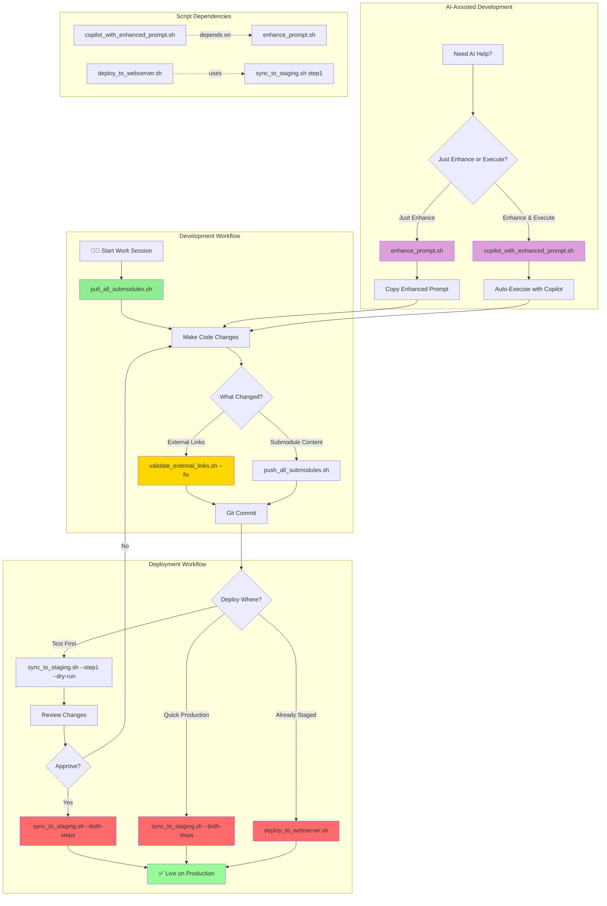

# Shell Scripts Directory

This directory contains shell automation scripts for managing the MP Barbosa personal website project and its four sibling projects (Music in Numbers, Guia Turístico, Monitora Vagas, Busca Vagas).

## 🗺️ Quick Script Selection Guide

**Use this decision tree to quickly find the right script for your task:**

```
What do you need to do?
│
├─ 📥 UPDATE CODE FROM REMOTE?
│  └─ Run: ./shell_scripts/pull_all_submodules.sh
│     Purpose: Pull main repo + all submodules
│     When: After other developers push changes, starting work session
│
├─ 📤 DEPLOY CODE CHANGES?
│  ├─ To staging (public directory)?
│  │  └─ Run: ./shell_scripts/sync_to_staging.sh --step1
│  │     Purpose: Sync src/ to public/ for testing
│  │     When: Testing deployment before production
│  │
│  ├─ To production (nginx server)?
│  │  ├─ Full two-step deployment?
│  │  │  └─ Run: ./shell_scripts/sync_to_staging.sh --both-steps
│  │  │     Purpose: Complete staging + production deployment
│  │  │     When: Ready to go live with changes
│  │  │
│  │  └─ Production only (after step1)?
│  │     └─ Run: sudo ./shell_scripts/deploy_to_webserver.sh
│  │        Purpose: Deploy public/ to /var/www/html
│  │        When: Public directory already prepared
│  │
│  └─ Push sibling project changes to remote?
│     └─ Run: ./shell_scripts/push_all_submodules.sh --handle-stash
│        Purpose: Push changes to sibling projects (convenience script)
│        When: Changes made to sibling project content
│        Note: Direct git push in each project directory is preferred
│
├─ 🔗 VALIDATE SECURITY?
│  └─ Run: ./shell_scripts/validate_external_links.sh
│     Purpose: Check external links for security attributes
│     When: After adding/modifying external links
│     Fix: Auto-fix with --fix flag
│
├─ 🧪 RUN TESTS IN DOCKER?
│  └─ Run: ./shell_scripts/run_npm_validations_in_docker.sh
│     Purpose: Run npm validations and all test suites inside Docker
│     When: Before CI comparisons or when local tooling differs from target platform
│
└─ 🤖 IMPROVE AI PROMPTS?
   ├─ Just enhance prompt?
   │  └─ Run: ./shell_scripts/enhance_prompt.sh "your prompt"
   │     Purpose: Get enhanced version of prompt
   │     When: Want better AI responses, learning prompt engineering
   │
   └─ Enhance and execute with Copilot?
      └─ Run: ./shell_scripts/copilot_with_enhanced_prompt.sh "your prompt"
         Purpose: Auto-enhance and run with GitHub Copilot
         When: Want better Copilot results automatically
```

**Quick Command Reference**:
| Task | Command | Frequency |
|------|---------|-----------|
| Start work session | `./shell_scripts/pull_all_submodules.sh` | Daily |
| Test deployment | `./shell_scripts/sync_to_staging.sh --step1 --dry-run` | Before production |
| Run Docker validations | `./shell_scripts/run_npm_validations_in_docker.sh` | Before CI / cross-platform checks |
| Deploy to production | `./shell_scripts/sync_to_staging.sh --both-steps` | Weekly/as needed |
| Validate links | `./shell_scripts/validate_external_links.sh --fix` | After link changes |
| Better AI prompts | `./shell_scripts/copilot_with_enhanced_prompt.sh "task"` | As needed |

---

## 📊 Workflow Diagram

**Visual overview of script relationships, dependencies, and typical workflows:**



**Workflow Categories**:

1. **🔄 Development Workflow** (Green): Daily development cycle
   - Pull updates → Make changes → Validate → Test → Commit

2. **🚀 Deployment Workflow** (Red/Pink): Production deployment paths
   - Test deployment → Review → Full deployment → Live
   - Or: Quick production (trusted changes)
   - Or: Legacy deployment (pre-staged files)

3. **🤖 AI-Assisted Development** (Purple): AI tooling integration
   - Prompt enhancement for better AI responses
   - Direct Copilot execution with auto-enhancement

4. **🔗 Script Dependencies** (Dotted lines): Inter-script relationships
   - `copilot_with_enhanced_prompt.sh` depends on `enhance_prompt.sh`
   - `deploy_to_webserver.sh` uses output from `sync_to_staging.sh --step1`

**Key Decision Points**:
- 🔶 **What Changed?** → Determines which validation to run
- 🔶 **Deploy Where?** → Chooses deployment path (test/production/legacy)
- 🔶 **Approve?** → Manual review gate before production
- 🔶 **Just Enhance or Execute?** → AI workflow selection

**ASCII Art Version** (for terminals without Mermaid support):

```
┌─────────────────────────────────────────────────────────────────────┐
│                     DEVELOPMENT WORKFLOW                            │
└─────────────────────────────────────────────────────────────────────┘

    START SESSION
         │
         ▼
    pull_all_submodules.sh ──────► Update main repo + submodules
         │
         ▼
    Make Changes
         │
         ▼
    ┌────────────────┐
    │  What Changed? │
    └────────┬───────┘
         ┌───┴───┬──────────┐
         ▼       ▼          ▼
    External Submodule  Nothing
     Links   Content
         │       │
         ▼       ▼
validate_  push_all_
external_  submodules.sh
links.sh
         │       │
         └───┬───┘
             ▼
        Git Commit
             │
             ▼

┌─────────────────────────────────────────────────────────────────────┐
│                     DEPLOYMENT WORKFLOW                             │
└─────────────────────────────────────────────────────────────────────┘

    Git Commit
         │
         ▼
    ┌─────────────┐
    │Deploy Where?│
    └──────┬──────┘
         ┌─┴──────┬────────────┬──────────────┐
         ▼        ▼            ▼              ▼
    Test First  Quick    Already Staged   Skip Deploy
         │     Production      │
         ▼        │            ▼
    sync_to_     │     deploy_to_webserver.sh
    public.sh    │            │
    --step1      │            │
    --dry-run    │            │
         │       │            │
         ▼       │            │
    Review       │            │
    Changes      │            │
         │       │            │
         ▼       ▼            ▼
    ┌─────────┐  │            │
    │Approve? │  │            │
    └────┬────┘  │            │
         │       │            │
    ┌────┴────┐  │            │
    ▼         ▼  ▼            ▼
   Yes       No  sync_to_     │
    │         │  public.sh    │
    │         │  --both-steps │
    │         │       │       │
    │         └───────┼───────┘
    │                 │
    ▼                 ▼
sync_to_         ┌────────────────┐
public.sh        │ ✅ PRODUCTION │
--both-steps     └────────────────┘
    │
    └─────────────┘

┌─────────────────────────────────────────────────────────────────────┐
│                  AI-ASSISTED DEVELOPMENT                            │
└─────────────────────────────────────────────────────────────────────┘

    Need AI Help?
         │
         ▼
    ┌──────────────────────────┐
    │Just Enhance or Execute?  │
    └────────┬─────────────────┘
         ┌───┴───┐
         ▼       ▼
    Just       Enhance
   Enhance   & Execute
         │       │
         ▼       ▼
  enhance_  copilot_with_
  prompt.sh enhanced_prompt.sh
         │       │
         ▼       ▼
    Copy     Auto-Execute
   Enhanced   with Copilot
    Prompt       │
         │       │
         └───┬───┘
             ▼
      Back to Changes

┌─────────────────────────────────────────────────────────────────────┐
│                   SCRIPT DEPENDENCIES                               │
└─────────────────────────────────────────────────────────────────────┘

copilot_with_enhanced_prompt.sh ───depends on──► enhance_prompt.sh
deploy_to_webserver.sh ─────────uses output──► sync_to_staging.sh (step1)
```

---

## 🚀 First-Time Setup

**Important**: Before running any scripts, ensure they have executable permissions:

```bash
# Make all scripts executable (run once from project root)
chmod +x shell_scripts/*.sh

# Or make individual scripts executable
chmod +x shell_scripts/pull_all_submodules.sh
chmod +x shell_scripts/push_all_submodules.sh
chmod +x shell_scripts/sync_to_staging.sh
chmod +x shell_scripts/deploy_to_webserver.sh
chmod +x shell_scripts/validate_external_links.sh
chmod +x shell_scripts/enhance_prompt.sh
chmod +x shell_scripts/copilot_with_enhanced_prompt.sh
```

**Verify permissions**:
```bash
# Check if scripts are executable (look for 'x' in permissions)
ls -l shell_scripts/*.sh
```

**Expected output**: `-rwxr-xr-x` (the 'x' indicates executable)

**Troubleshooting**:
- If you get `Permission denied` error, run the chmod commands above
- If scripts still don't run, check your shell with `echo $SHELL`
- Ensure you're running bash scripts with bash: `bash shell_scripts/script_name.sh`

**Current Script Status** (all scripts should be executable):

| Script | Purpose | Executable Required |
|--------|---------|---------------------|
| `deprecated/pull_all_submodules.sh` | 🔴 DEPRECATED - Use direct git commands | ❌ Not recommended |
| `deprecated/push_all_submodules.sh` | 🔴 DEPRECATED - Use direct git commands | ❌ Not recommended |
| `sync_to_staging.sh` | Two-step deployment | ✅ Yes |
| `deploy_to_webserver.sh` | Legacy nginx deployment | ✅ Yes (requires sudo) |
| `validate_external_links.sh` | Link security validation | ✅ Yes |
| `enhance_prompt.sh` | AI prompt enhancement | ✅ Yes |
| `copilot_with_enhanced_prompt.sh` | Enhanced Copilot execution | ✅ Yes |

---

## Available Scripts

### 🧹 Maintenance & Cleanup Scripts

#### `cleanup_old_folders.sh`
**Purpose**: Clean up old backup and temporary folders

**Features**:
- ✅ Manages backlog, logs, and summaries directories
- ✅ Retention policy: keeps 15 most recent workflow runs
- ✅ Sorted by modification time for intelligent cleanup
- ✅ Safe deletion with preview mode
- ✅ Colored output with deletion summary

**Usage**:
```bash
./shell_scripts/cleanup_old_folders.sh           # Clean up old workflow outputs
./shell_scripts/cleanup_old_folders.sh --help    # Show help
```

**Version**: 1.1.6

---

#### `consolidate_docs.sh`
**Purpose**: Documentation consolidation and cleanup automation

**Features**:
- ✅ Implements documentation retention policy
- ✅ Consolidates reports into historical archive
- ✅ Manages docs/reports directory structure
- ✅ Automatic cleanup of workflow logs
- ✅ Comprehensive archiving strategy

**Usage**:
```bash
./shell_scripts/consolidate_docs.sh              # Consolidate documentation
./shell_scripts/consolidate_docs.sh --help       # Show help
```

**Version**: 1.1.6

---

#### `manage_reports.sh`
**Purpose**: Automated report file management with timestamp-based naming

**Features**:
- ✅ Manages consistency validation reports
- ✅ Automatic archiving with 30-day retention
- ✅ Timestamp-based file organization
- ✅ Archive directory management
- ✅ Cleanup of outdated reports

**Usage**:
```bash
./shell_scripts/manage_reports.sh                # Manage validation reports
./shell_scripts/manage_reports.sh --help         # Show help
```

**Version**: 1.1.6

---

### 🔍 Documentation Validation Scripts

#### `fix_documentation_consistency.sh`
**Purpose**: Automatically fix documentation consistency issues

**Features**:
- ✅ Repairs cross-reference inconsistencies
- ✅ Updates version numbers across documentation
- ✅ Fixes broken internal links
- ✅ Standardizes formatting
- ✅ Automated correction with backup

**Usage**:
```bash
./shell_scripts/fix_documentation_consistency.sh              # Fix consistency issues
./shell_scripts/fix_documentation_consistency.sh --dry-run    # Preview fixes
./shell_scripts/fix_documentation_consistency.sh --help       # Show help
```

---

#### `validate_documentation_consistency.sh`
**Purpose**: Validate documentation consistency across the project

**Features**:
- ✅ Checks cross-references between documents
- ✅ Validates version number consistency
- ✅ Verifies internal link integrity
- ✅ Reports inconsistencies with file locations
- ✅ CI/CD compatible exit codes

**Usage**:
```bash
./shell_scripts/validate_documentation_consistency.sh         # Validate documentation
./shell_scripts/validate_documentation_consistency.sh --help  # Show help
```

---

### 🧪 Testing & Performance Scripts

#### `workflow/test_modules.sh`
**Purpose**: Verify all workflow modules are syntactically correct and functional

**Features**:
- ✅ Tests all library modules (11 modules)
- ✅ Tests all step modules (13 modules)
- ✅ Syntax validation with bash -n
- ✅ Function existence verification
- ✅ Comprehensive test reporting

**Usage**:
```bash
./shell_scripts/workflow/test_modules.sh          # Test all modules
./shell_scripts/workflow/test_modules.sh --help   # Show help
```

**Part of**: Tests & Documentation Workflow Automation v2.0.0

---

#### `workflow/test_file_operations.sh`
**Purpose**: Validate file operations module resilience and error recovery

**Features**:
- ✅ Tests file_operations.sh library module
- ✅ Validates resilience features
- ✅ Tests error recovery mechanisms
- ✅ Comprehensive edge case testing
- ✅ Detailed test result reporting

**Usage**:
```bash
./shell_scripts/workflow/test_file_operations.sh  # Test file operations
```

**Part of**: Tests & Documentation Workflow Automation v2.0.0

---

#### `workflow/test_session_manager.sh`
**Purpose**: Test session management functionality for bash command execution

**Features**:
- ✅ Tests session_manager.sh library module
- ✅ Validates session lifecycle management
- ✅ Tests cleanup handlers
- ✅ Verifies timeout mechanisms
- ✅ Comprehensive session testing

**Usage**:
```bash
./shell_scripts/workflow/test_session_manager.sh  # Test session manager
```

**Part of**: Tests & Documentation Workflow Automation v2.0.0

---

#### `workflow/benchmark_performance.sh`
**Purpose**: Measure and compare performance of optimized vs standard operations

**Features**:
- ✅ Benchmarks performance.sh module optimizations
- ✅ Measures file operation speeds
- ✅ Compares optimized vs standard implementations
- ✅ Generates performance metrics
- ✅ Identifies optimization opportunities

**Usage**:
```bash
./shell_scripts/workflow/benchmark_performance.sh  # Run performance benchmarks
```

**Part of**: Tests & Documentation Workflow Automation v2.0.0

---

#### `workflow/example_session_manager.sh`
**Purpose**: Demonstrate session management best practices in workflow steps

**Features**:
- ✅ Example implementations of session patterns
- ✅ Best practices for sync/async execution
- ✅ Timeout configuration examples
- ✅ Cleanup handler demonstrations
- ✅ Educational reference code

**Usage**:
```bash
./shell_scripts/workflow/example_session_manager.sh  # Run examples
```

**Part of**: Tests & Documentation Workflow Automation v2.0.0

---

### 📚 Workflow Library Modules

The following are library modules (not meant to be executed directly):

#### `workflow/lib/file_operations.sh`
**Purpose**: File resilience and atomic operations for workflow steps

**Features**:
- Atomic file writes with backup
- Safe directory creation
- Error recovery mechanisms
- File existence validation

**Executable**: ✅ Yes (now executable)
**Sourced by**: All workflow step modules

---

#### `workflow/lib/performance.sh`
**Purpose**: Performance optimization utilities for workflow operations

**Features**:
- File operation caching
- Batch processing optimization
- Performance measurement utilities
- Resource usage tracking

**Executable**: ✅ Yes (now executable)
**Sourced by**: Workflow steps requiring optimization

---

#### `workflow/lib/session_manager.sh`
**Purpose**: Bash command session lifecycle management

**Features**:
- Session creation and cleanup
- Timeout management
- Cleanup trap handlers
- Session state tracking

**Executable**: ✅ Yes (now executable)
**Sourced by**: Workflow steps executing bash commands

#### `workflow/lib/metrics_validation.sh`
**Purpose**: Project metrics validation and consistency verification across documentation

**Version**: 2.0.0

**Features**:
- Automatic metric calculation from source files
- Line count validation for workflow modules
- Cross-reference validation between documentation files
- Module count verification
- Formatted output with thousands separators
- Standalone or workflow-integrated usage
- Inconsistency detection and reporting

**Core Functions**:
- `calculate_workflow_metrics()` - Calculate actual line counts from workflow modules
- `format_number()` - Format numbers with thousands separator (6993 → 6,993)
- `validate_doc_metrics()` - Validate line count references in documentation
- `validate_module_counts()` - Verify module count consistency
- `validate_all_documentation_metrics()` - Comprehensive validation across all docs
- `generate_metrics_report()` - Generate formatted metrics summary

**Global Variables**:
Sets the following variables after calling `calculate_workflow_metrics()`:
- `ACTUAL_LIB_LINES` - Total lines in library modules
- `ACTUAL_LIB_COUNT` - Number of library modules
- `ACTUAL_STEP_LINES` - Total lines in step modules
- `ACTUAL_STEP_COUNT` - Number of step modules
- `ACTUAL_TOTAL_LINES` - Total modular code lines
- `ACTUAL_TOTAL_MODULES` - Total module count
- `ACTUAL_MAIN_LINES` - Main workflow script lines

**Usage Example**:
```bash
# Standalone usage
source shell_scripts/workflow/lib/metrics_validation.sh
calculate_workflow_metrics "shell_scripts/workflow"
generate_metrics_report

# Validate specific documentation file
validate_doc_metrics "README.md" 6993 3045 3948

# Comprehensive validation of all documentation
validate_all_documentation_metrics
```

**Integration**: Used by Step 3 (Script References) in the workflow automation to detect documentation drift and ensure metric accuracy.

**Executable**: ✅ Yes
**Sourced by**: Step 3 (script reference validation), standalone validation scripts

---

## Available Scripts

### 🔴 Deprecated Scripts

**Note**: The following scripts have been moved to `shell_scripts/deprecated/` and are no longer recommended:

- `deprecated/pull_all_submodules.sh` - Use direct `git pull` in each sibling project
- `deprecated/push_all_submodules.sh` - Use direct `git push` in each sibling project

**Reason**: Project migrated from git submodules to sibling project architecture (December 2025).

**See**: `shell_scripts/deprecated/README.md` for migration details and current recommended workflow.

---

### 📁 `sync_to_staging.sh` (Two-Step Deployment Architecture v2.0.0)
**Purpose**: Two-step deployment process for MP Barbosa site with parametrized step control

**Recent Changes (v2.0.0)**:
- ✅ **Complete architectural transformation**: Single-step → Two-step deployment
- ✅ **Parametrized step control**: Execute step1, step2, or both independently
- ✅ **Production directory configuration**: `--production-dir` parameter support
- ✅ **Enhanced summary reporting**: Separate summaries for each deployment step
- ✅ **Comprehensive test coverage**: 849 lines of Jest tests (53 tests, 52/53 passing)
- ✅ **Improved help documentation**: Step-specific examples and options

**Features**:
- ✅ **Step 1**: Copy resources from /src to /public folder for staging
- ✅ **Step 2**: Copy resources from /public to production web server directory
- ✅ Parametrized execution (step1, step2, or both-steps)
- ✅ Production directory configuration support (default: `/var/www/html`)
- ✅ Comprehensive asset management (HTML, CSS, JS, images, webfonts)
- ✅ Music in Numbers sibling project support with complete module architecture
- ✅ Guia Turístico sibling project support with complete project structure
- ✅ Monitora Vagas dual-directory deployment (src/ + public/)
- ✅ Busca Vagas full-stack deployment (client HTML + server API)
- ✅ Enhanced backup system for both public and production deployments
- ✅ Comprehensive validation and reporting for each step
- ✅ Dry-run mode for safe operation preview

**Usage**:
```bash
# Step Options (at least one required)
./shell_scripts/sync_to_staging.sh --step1                              # Copy source to public only
./shell_scripts/sync_to_staging.sh --step2                              # Copy public to production only
./shell_scripts/sync_to_staging.sh --both-steps                         # Execute both steps
./shell_scripts/sync_to_staging.sh --step1 --dry-run --verbose          # Preview step 1 with details
./shell_scripts/sync_to_staging.sh --step2 --production-dir /var/www/mpbarbosa  # Custom production directory
./shell_scripts/sync_to_staging.sh --both-steps --no-backup --verbose   # Both steps without backup
./shell_scripts/sync_to_staging.sh --help                               # Show help
```

**Two-Step Process**:
**Step 1 (Source → Public)**:
1. Environment validation and backup creation
2. Main HTML files (index.html, robots.txt, humans.txt)
3. Asset directories (CSS, JS, SASS, webfonts, images)
4. Music in Numbers sibling project (3 HTML files, 15+ JS modules, 4 CSS files)
5. Guia Turístico sibling project
6. Monitora Vagas sibling project from ../monitora_vagas:
   - **src/ folder**: Legacy implementation (services, styles)
   - **public/ folder**: Modern v2.0.0 implementation with:
     - Configuration layer (app.js, constants.js, environment.js, index.js)
     - BuscaVagasAPIClient class with fetch API
     - Modular CSS architecture (global/, components/, pages/)
     - Archived UI versions for historical reference
     - Service worker (sw.js) for PWA support
     - Complete vendor library bundling (jQuery, datepicker, Select2, Font Awesome 4.7, MDI Font)
     - Symlink resolution with -L flag for proper content copying
7. Busca Vagas sibling project from ../busca_vagas (full-stack app with Node.js API)
8. Systemd service deployment with sudo privilege handling for system directories
9. Additional resources (extensible for future needs)
10. Comprehensive validation of all copied resources

**Step 2 (Public → Production)**:
1. Production environment validation and permission checks
2. Production backup creation with 7-day retention
3. Efficient file synchronization using rsync/cp
4. Production deployment validation
5. Web server ready file structure (755/644 permissions)

**Production Directory Options**:
- Default: `/var/www/html`
- Custom: `--production-dir /path/to/webroot`
- Configurable for different deployment scenarios

**Key Architecture Benefits**:
- **Flexible Deployment**: Independent or combined step execution
- **Staging Environment**: Public folder acts as staging area for validation
- **Production Safety**: Separate production deployment with comprehensive validation
- **Parametrized Control**: Choose exactly which deployment steps to execute
- **Enhanced Backup**: Separate backup systems for public and production environments

---

### 🌐 `deploy_to_webserver.sh` (Legacy Deployment v2.0.0)
**Purpose**: Deploys the website to nginx web server directory for production hosting

**⚠️ Architecture Note**: This script now uses the `/public` directory as its source (prepared by `sync_to_staging.sh`). For modern deployments, use the two-step `sync_to_staging.sh` workflow instead.

**Recent Changes (v2.0.0)**:
- ✅ **Source changed**: Now deploys from `PROJECT_ROOT/public` instead of `PROJECT_ROOT`
- ✅ **Dependency requirement**: Requires `sync_to_staging.sh --step1` to be run first
- ✅ **Git validation**: Checks project root for git repository (not source directory)
- ✅ **Path updates**: All validation paths updated for new public directory structure
- ✅ **Comprehensive test coverage**: 849 lines of Jest tests (53 tests, 52/53 passing)
- ✅ **Help documentation**: Updated workflow and requirement sections

**Features**:
- ✅ Deploys from pre-staged `/public` directory
- ✅ Automatic backup of existing production deployment
- ✅ Git submodule validation (checks project root)
- ✅ Web server permission setting (www-data)
- ✅ nginx configuration validation
- ✅ Comprehensive deployment validation
- ✅ Colored output for better visibility

**Usage**:
```bash
# First, prepare files in public directory
./shell_scripts/sync_to_staging.sh --step1

# Then deploy to production (requires sudo)
sudo ./shell_scripts/deploy_to_webserver.sh             # Full deployment
./shell_scripts/deploy_to_webserver.sh --dry-run       # Preview deployment
./shell_scripts/deploy_to_webserver.sh --no-backup     # Deploy without backup
./shell_scripts/deploy_to_webserver.sh --help          # Show help
```

**Deployment Process**:
1. Validate environment and project repository
2. **Verify `/public` directory exists** (fails if missing - run `sync_to_staging.sh --step1` first)
3. Create backup of existing deployment to `/var/www/backups/mpbarbosa.com`
4. Copy all files from `/public` to `/var/www/mpbarbosa.com` using rsync
5. Set proper web server permissions (www-data:www-data, 755/644)
6. Validate deployment structure (checks `index.html`, `assets/css/main.css`, `assets/js/main.js`)
7. Check nginx configuration

**Modern Alternative**: Use `sync_to_staging.sh --both-steps` for the complete two-step deployment workflow with production directory configuration support.

---


### ✅ `validate_external_links.sh`
**Purpose**: Validates that all external links follow the security policy of opening in new tabs with proper attributes

**Features**:
- ✅ Scans all HTML files across main site and deployed sibling projects
- ✅ Identifies external links (http/https URLs in `<a>` tags)
- ✅ Validates `target="_blank"` attribute presence
- ✅ Validates `rel="noopener noreferrer"` security attributes
- ✅ Colored output showing compliant and non-compliant links
- ✅ Line-by-line reporting with exact file locations
- ✅ Comprehensive validation summary with issue count
- ✅ Exit code 0 for success, 1 for failures (CI/CD compatible)

**Usage**:
```bash
# Standard validation (from project root)
./shell_scripts/validate_external_links.sh

# Run from any directory
cd /path/to/mpbarbosa_site && ./shell_scripts/validate_external_links.sh

# Use in CI/CD pipeline
./shell_scripts/validate_external_links.sh || exit 1
```

**Validation Criteria**:
- ✅ All `<a>` tags with external URLs (http/https) must have `target="_blank"`
- ✅ All external links must include `rel="noopener noreferrer"` for security
- ✅ Excludes `<link>` tags (stylesheets/fonts don't need these attributes)
- ✅ Checks main site files and all submodule HTML files

**Files Scanned**:
```
src/index.html              # Main landing page
src/components/*.html       # Component files
src/pages/*.html           # Redirect pages
public/submodules/*/src/*.html # Submodule HTML files (via sync_to_staging.sh)
```

**Output Format**:

**Example - All Compliant**:
```
=== External Links Policy Validation ===

Scanning HTML files...

Checking: src/index.html
  ✅ Line 127: Compliant
  ✅ Line 134: Compliant
  ✅ Line 141: Compliant

=== Validation Summary ===
✅ All external links are compliant!
```

**Example - Issues Found**:
```
=== External Links Policy Validation ===

Scanning HTML files...

Checking: src/pages/example.html
  ❌ Line 42: Missing target="_blank"
     <a href="https://example.com">Link</a>
  ❌ Line 55: Missing rel="noopener noreferrer"
     <a href="https://example.com" target="_blank">Link</a>
  ✅ Line 68: Compliant

=== Validation Summary ===
❌ Found 2 issue(s) that need fixing
Please review and apply the correct attributes:
  target="_blank" rel="noopener noreferrer"
```

**Security Benefits**:
- **`target="_blank"`**: Opens external links in new tabs, preventing navigation away from your site
- **`rel="noopener"`**: Prevents the new page from accessing `window.opener` (tabnapping attack prevention)
- **`rel="noreferrer"`**: Prevents sending the `Referer` header to external sites (privacy protection)

**Common Fixes**:

**Before** (Non-compliant):
```html
<a href="https://example.com">External Link</a>
<a href="https://example.com" target="_blank">Link</a>
```

**After** (Compliant):
```html
<a href="https://example.com" target="_blank" rel="noopener noreferrer">External Link</a>
<a href="https://example.com" target="_blank" rel="noopener noreferrer">Link</a>
```

**Integration with Development Workflow**:
```bash
# Pre-commit validation
git add . && ./shell_scripts/validate_external_links.sh && git commit -m "feat: add new content"

# CI/CD pipeline step
- name: Validate External Links
  run: ./shell_scripts/validate_external_links.sh
```

**Exit Codes**:
- `0`: All external links are compliant
- `1`: Issues found that need fixing

**Limitations**:
- Only checks `<a>` tags (not JavaScript-generated links)
- Requires links to be in standard HTML format
- Does not validate link destinations (only attributes)
- Case-sensitive attribute matching

**Related Documentation**:
- **External Links Policy**: `/docs/EXTERNAL_LINKS_POLICY.md` - Complete security and UX standards
- **Comprehensive UX Guide**: `/docs/COMPREHENSIVE_UX_DOCUMENTATION.md` - Accessibility and interaction patterns

**Script Version**: 1.1.6
**Last Updated**: November 9, 2025

---

### 🤖 `enhance_prompt.sh`
**Purpose**: Enhances user prompts using GitHub Copilot CLI for improved clarity and technical language

**Script Version**: 1.1.6
**Last Updated**: November 9, 2025

**Features**:
- ✅ Improves English grammar and technical terminology
- ✅ Adds relevant context and technical details
- ✅ Preserves original intent while clarifying requirements
- ✅ Optimized for software development and technical tasks
- ✅ Colored output for better readability

**Usage**:
```bash
./shell_scripts/enhance_prompt.sh [OPTIONS] "your prompt here"
./shell_scripts/enhance_prompt.sh --help       # Show help
./shell_scripts/enhance_prompt.sh --version    # Show version
```

**Example**:
```bash
# Original: "fix the bug in the script"
# Enhanced: "Debug and resolve the logical error in the shell script, ensuring proper error handling and exit codes"
```

---

### 🚀 `copilot_with_enhanced_prompt.sh`
**Purpose**: Executes GitHub Copilot CLI with automatically enhanced prompts for better results

**Script Version**: 1.1.6
**Last Updated**: November 9, 2025

**Features**:
- ✅ Automatically enhances prompts using `enhance_prompt.sh`
- ✅ Shows both original and enhanced prompts for transparency
- ✅ Interactive confirmation before execution
- ✅ Seamless integration with GitHub Copilot CLI
- ✅ Colored output with clear formatting

**Usage**:
```bash
./shell_scripts/copilot_with_enhanced_prompt.sh [OPTIONS] "your prompt here"
```

**Parameters**:
- `-h, --help` - Show help message and usage examples
- `--version` - Show script version
- `-m, --model MODEL` - Specify AI model for both enhancement and execution stages
- `--enhance-model MODEL` - Specify AI model only for the enhancement step
- `--exec-model MODEL` - Specify AI model only for the execution step
- `-s, --save FILE` - Save enhanced prompt to specified file before execution
- `-v, --verbose` - Show detailed processing information during execution
- `--show-enhanced` - Display the enhanced prompt before executing with Copilot
- `--dry-run` - Only enhance the prompt without executing it with Copilot

**Examples**:
```bash
# Basic usage
./shell_scripts/copilot_with_enhanced_prompt.sh "Fix the login"

# Use specific model for both stages
./shell_scripts/copilot_with_enhanced_prompt.sh -m claude-sonnet-4.5 "Add validation to form"

# Show enhanced prompt before execution
./shell_scripts/copilot_with_enhanced_prompt.sh --show-enhanced "Optimize database queries"

# Dry-run with save to file
./shell_scripts/copilot_with_enhanced_prompt.sh --dry-run -s enhanced.txt "Debug authentication"
```

**Workflow**:
1. User provides natural language prompt
2. Script enhances prompt for clarity and context
3. Displays both original and enhanced versions
4. Prompts for confirmation
5. Executes GitHub Copilot with enhanced prompt

**Dependencies**: Requires `enhance_prompt.sh` in the same directory

---

## Git Best Practices Integration

Both scripts follow the comprehensive git best practices established in `/docs/GIT_BEST_PRACTICES_GUIDE.md`:

### ✅ **Proper Submodule Handling**
- Hierarchical operations (respect nesting levels)
- Safe stash management during operations
- Comprehensive error handling and validation
- Clear status reporting and verification

### ✅ **Repository Safety**
- Always check git repository validity before operations
- Preserve local changes through intelligent stashing
- Provide dry-run options for operation preview
- Interactive prompts for critical operations

### ✅ **Professional Standards**
- Conventional commit message formats encouraged
- Comprehensive logging with colored output
- Detailed help documentation and examples
- Error handling with graceful exit strategies

## Project Structure Context

These scripts are designed for the MP Barbosa personal website project structure:

```
mpbarbosa_site/ (main repository)
├── shell_scripts/              # These automation scripts
│   ├── pull_all_submodules.sh  # Git submodule synchronization
│   ├── push_all_submodules.sh  # Git submodule publishing
│   ├── sync_to_staging.sh       # Two-step deployment (v2.0.0)
│   ├── deploy_to_webserver.sh  # Legacy production deployment (v2.0.0)
│   └── README.md               # This documentation
├── public/submodules/          # Deployed submodules (via sync_to_staging.sh)
│   ├── guia_js/        # Travel guide project (from sibling)
│   ├── music_in_numbers/      # Spotify analytics project (from sibling)
│   ├── monitora_vagas/        # Job monitoring project (from sibling)
│   └── busca_vagas/           # Job search platform (from sibling)
├── docs/                      # Documentation including git best practices
└── ../                        # Sibling projects (not git submodules)
    ├── guia_js/        # Travel guide project
    ├── music_in_numbers/      # Spotify analytics project
    ├── monitora_vagas/        # Job monitoring project
    └── busca_vagas/           # Job search platform
```

## Usage Examples

### Daily Development Workflow
```bash
# Start of day: pull all latest changes
./shell_scripts/pull_all_submodules.sh

# Stage content in public directory for validation
./shell_scripts/sync_to_staging.sh --step1 --verbose

# Validate external links policy compliance
./shell_scripts/validate_external_links.sh

# Deploy to production when ready
./shell_scripts/sync_to_staging.sh --step2

# End of day: push all changes
./shell_scripts/push_all_submodules.sh

# Handle accumulated stashes
./shell_scripts/push_all_submodules.sh --handle-stash
```

### Production Deployment Workflow (Two-Step Process)
```bash
# Option 1: Two-step process (recommended for staging validation)
./shell_scripts/sync_to_staging.sh --step1 --verbose        # Stage files in public folder
# Validate staged files, then deploy to production
./shell_scripts/sync_to_staging.sh --step2 --dry-run        # Preview production deployment
./shell_scripts/sync_to_staging.sh --step2                  # Deploy to production

# Option 2: Combined deployment (direct source to production)
./shell_scripts/sync_to_staging.sh --both-steps --verbose   # Execute both steps
./shell_scripts/sync_to_staging.sh --both-steps --dry-run   # Preview entire workflow

# Option 3: Custom production directory
./shell_scripts/sync_to_staging.sh --step2 --production-dir /var/www/mpbarbosa

# Legacy deployment script (still available)
./shell_scripts/deploy_to_webserver.sh --dry-run           # Preview deployment
sudo ./shell_scripts/deploy_to_webserver.sh                # Deploy to production
```

### Safe Operation Verification
```bash
# Preview what would be pulled
./shell_scripts/pull_all_submodules.sh --dry-run

# Preview two-step deployment process
./shell_scripts/sync_to_staging.sh --step1 --dry-run        # Preview step 1 (source to public)
./shell_scripts/sync_to_staging.sh --step2 --dry-run        # Preview step 2 (public to production)
./shell_scripts/sync_to_staging.sh --both-steps --dry-run   # Preview entire workflow

# Preview what would be pushed
./shell_scripts/push_all_submodules.sh --dry-run
```

### Emergency Recovery
```bash
# Pull with automatic stash handling
./shell_scripts/pull_all_submodules.sh  # Automatically stashes and restores

# Check repository status after operations
git status

# Check sibling project status (if needed)
cd ../music_in_numbers && git status
cd ../guia_js && git status
cd ../monitora_vagas && git status
cd ../busca_vagas && git status
```

## Error Handling

Both scripts include comprehensive error handling:

- **Git Repository Validation**: Ensures operations only run in valid git repositories
- **Network Connectivity**: Graceful handling of network issues during fetch/push
- **Merge Conflicts**: Clear instructions for manual resolution when needed
- **Permission Issues**: Helpful error messages for access problems
- **Stash Conflicts**: Safe handling of stash pop conflicts with user guidance

## Customization

The scripts can be customized by modifying these variables at the top of each file:

```bash
# Colors for output (can be disabled by setting to empty)
RED='\033[0;31m'
GREEN='\033[0;32m'
# ... etc

# Default behavior flags
HANDLE_STASH=false  # Set to true to always handle stashes
```

## Integration with IDE/Editor

These scripts can be integrated into IDEs and editors:

### VS Code Integration
Add to `.vscode/tasks.json`:
```json
{
    "label": "Pull All Submodules",
    "type": "shell",
    "command": "./shell_scripts/pull_all_submodules.sh",
    "group": "build"
}
```

### Command Aliases
Add to your shell profile (`.bashrc`, `.zshrc`):
```bash
alias pullall='cd /path/to/mpbarbosa_site && ./shell_scripts/pull_all_submodules.sh'
alias pushall='cd /path/to/mpbarbosa_site && ./shell_scripts/push_all_submodules.sh'
alias deploysite='cd /path/to/mpbarbosa_site && sudo ./shell_scripts/deploy_to_webserver.sh'
alias deploypreview='cd /path/to/mpbarbosa_site && ./shell_scripts/deploy_to_webserver.sh --dry-run'
```

## Historical Documentation (v2.0.0)

### Consolidated Validation Reports

To reduce repository clutter, historical validation reports have been consolidated into three comprehensive files in the `/docs` directory:

1. **`DIRECTORY_STRUCTURE_VALIDATION_HISTORY_CONSOLIDATED.md`**
   - Consolidates 9 directory structure validation reports (Nov 13-25, 2025)
   - Tracks architectural consistency over 12-day period
   - All reports show ✅ EXCELLENT status

2. **`DOCUMENTATION_CONSISTENCY_HISTORY_CONSOLIDATED.md`**
   - Consolidates documentation consistency analysis reports
   - Historical tracking of cross-reference accuracy and terminology consistency
   - Preserves lessons learned and best practices evolution

3. **`SHELL_SCRIPT_VALIDATION_HISTORY_CONSOLIDATED.md`**
   - Consolidates shell script validation reports
   - Documents shell script quality and best practices compliance
   - Historical record of script improvements and refactoring

**Cleanup Pattern**: Individual timestamped reports deleted after consolidation to maintain clean repository structure while preserving complete historical analysis.

## Development Environment Documentation

The project includes comprehensive development environment documentation in the `/docs` directory:

### Development Tools Configuration
- **[Dependabot Setup Guide](../docs/DEPENDABOT_SETUP.md)** - Automated dependency monitoring with weekly scans and intelligent PR grouping (`.github/dependabot.yml`)
- **[Markdown Linting Guide](../docs/MARKDOWN_LINTING_GUIDE.md)** - Best practices for AI-generated documentation with `.mdlrc` configuration
- **[Markdown Linting Solution Summary](../docs/MARKDOWN_LINTING_SOLUTION_SUMMARY.md)** - Complete solution for recurring MD001, MD002, MD012, MD013, MD022, MD029, MD031, MD032 issues
- **[Naming Convention Fix Report](../docs/NAMING_CONVENTION_FIX_REPORT.md)** - File naming standardization improvements and lessons learned

### Test Environment Setup
- **[Selenium E2E Setup Guide](../docs/SELENIUM_E2E_SETUP_GUIDE.md)** - Browser automation test configuration with ChromeDriver/GeckoDriver setup (Status: Not Yet Configured)
- **[Test Environment Configuration Report](../docs/TEST_ENVIRONMENT_CONFIGURATION_REPORT.md)** - Environment setup analysis and troubleshooting
- **[Test Environment Final Report](../docs/TEST_ENVIRONMENT_FINAL_REPORT.md)** - Comprehensive test environment documentation with Jest configuration

### Node.js Version Management
The project uses **Node.js v25.2.1** with version management files:
- `.node-version` - For fnm, nodenv, and asdf compatibility
- `.nvmrc` - For nvm (Node Version Manager) compatibility

### Editor Configuration
The project includes `.editorconfig` for consistent coding styles:
- Markdown: 4-space indentation, no max line length
- JavaScript/TypeScript: 2-space indentation
- Shell scripts: Tab indentation (4 spaces)
- HTML/CSS: 2-space indentation
- Automatic charset (UTF-8), line endings (LF), and trailing whitespace handling

## Contributing

When contributing to these scripts:

1. **Follow bash best practices**: Use `set -e` and `set -u` for safety
2. **Maintain color coding**: Keep the consistent color scheme for output
3. **Add comprehensive help**: Update help functions for new features
4. **Test thoroughly**: Test with various repository states and edge cases
5. **Document changes**: Update this README with new features or usage patterns

## Version History

- **v2.0.0** (December 2025): Major development environment enhancements
  - **New Configuration Files**: `.editorconfig`, `.mdlrc`, `.node-version`, `.nvmrc`, `.github/dependabot.yml`
  - **Automated Dependency Management**: Weekly Dependabot scans with intelligent PR grouping
  - **Markdown Linting**: Comprehensive `.mdlrc` configuration for AI-generated documentation
  - **Node.js Version Lock**: v25.2.1 with nvm and fnm compatibility
  - **Documentation Expansion**: 7 new guides (Dependabot, Markdown Linting, Selenium E2E, Test Environment, Naming Conventions)
- **v1.1.6** (October 27, 2025): Initial release with full hierarchical submodule support
  - **Features**: Pull/push scripts with proper order, stash handling, comprehensive logging

---

**Author**: MP Barbosa
**Last Updated**: December 11, 2025
**License**: Private project scripts
